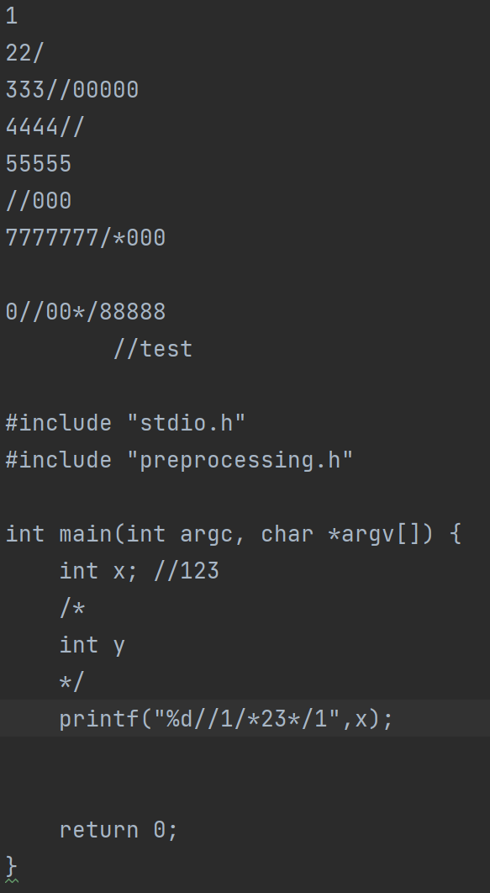
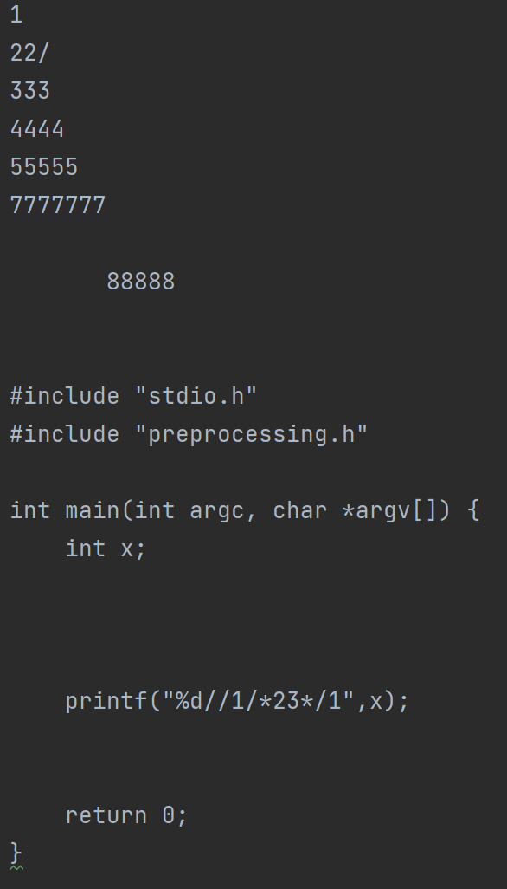

# 实验一 预处理

`preprocessing.c` 中的函数 `void preprocessing(FILE *in, FILE *out)` 完成了对文本文件的预处理，即从任意字符串中剔除C语言形式的注释，包括单行注释和多行注释。此外，该函数不会剔除字符串字面量中的 `//` 和 `/*` 。

函数一行一行的读取文件，存入 `buffer` 中，剔除掉注释后，再写入目标文件。

变量 `is_in_multiline_comments` 标记当前读取的字符是否在行内注释中；变量 `is_in_string` 标记当前读取的字符是否在字符串字面量中。

使用程序对如下文本文件进行处理：

得到如下结果：

符合预期。