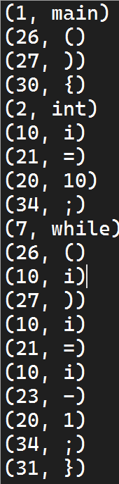

# 实验三 词法分析

本次实验完成了 LittleC 的词法分析器。

规定各种符号的种别码：

| 符号  | 种别码 |
| ----- | ------ |
| main  | 1      |
| int   | 2      |
| char  | 3      |
| if    | 4      |
| else  | 5      |
| for   | 6      |
| while | 7      |
| ID    | 10     |
| NUM   | 20     |
| =     | 21     |
| +     | 22     |
| -     | 23     |
| *     | 24     |
| /     | 25     |
| (     | 26     |
| )     | 27     |
| [     | 28     |
| ]     | 29     |
| {     | 30     |
| }     | 31     |
| ,     | 32     |
| :     | 33     |
| ;     | 34     |
| >     | 35     |
| <     | 36     |
| >=    | 37     |
| <=    | 38     |
| ==    | 39     |
| !=    | 40     |

## 核心代码

``` C
int get_pair(const char* str) {

	int i = 0;
	static int index_symbol_table = 0;
	static int index_pair = 0;
	while (str[i] != '\0') {

		if (isdigit(str[i])) { // 如果是数字

			int start = i;

			while (isdigit(str[i])) {
				i++;
			}
			if (i - start > 15)
				continue;
			char token[16];
			memcpy(token, str + start, i - start);
			token[i - start] = '\0';

			pair[index_pair].type_id = TYPE_NUMBER;
			pair[index_pair].attr = atoi(token);
			index_pair++;

		}
		else if (is_operator(str[i])) { // 如果是运算符

			int start = i;

			if (is_operator(str[i + 1]) == 1) {
				char tmp[] = { str[i], str[i + 1], '\0' };
				if (get_type_id(tmp) != 0)
					i++;
			}
			i++;
			char token[4];
			memcpy(token, str + start, i - start);
			token[i - start] = '\0';
			pair[index_pair].type_id = get_type_id(token);
			strcpy(pair[index_pair].str, token);
			index_pair++;

		}
		else if (is_alpha(str[i])) { // 如果是字符串
			int start = i;

			while (is_alpha(str[i]) || isdigit(str[i])) {
				i++;
			}
			if (i - start > 15)
				continue;
			char token[16];
			memcpy(token, str + start, i - start);
			token[i - start] = '\0';
			if (is_keyword(token) == 1) { // 如果是关键字
				pair[index_pair].type_id = get_type_id(token);
				strcpy(pair[index_pair].str, token);
				index_pair++;
			}
			else if (is_keyword(token) == 0) { // 如果是标识符
				strcpy(symbol_table[index_symbol_table].name, token);

				pair[index_pair].type_id = TYPE_IDENTIFIER;
				pair[index_pair].attr = index_symbol_table;
				strcpy(pair[index_pair].str, token);

				index_symbol_table++;
				index_pair++;
                
			}
		}
		else {
			i++;
		}
	}

	return index_pair;
}
```

## 思路

代码逻辑魔改了上次实验的标识符识别，让它不仅能识别标识符还能识别关键字、操作符和数字。

str[i]为扫描到的有效字符串的第一个字符，这个字符串可能为标识符、关键字、数字。如果是该字符串是数字开头的，那么继续向后扫描，遇到一个非数字的字符则为该字符串的结束；如果是该字符串是字母，那么继续向后扫描，遇到一个空白或操作符则为该字符串的结束；操作符有可能为两个字符，则向后多读一个字符，判断这两个字符是否为操作符。

下次扫描从上次结束扫描的地方开始。

之后计划使用状态机重构代码。

## 运行

程序读取以下字符串：

``` C
main()
{
int i=10;
while(i) i=i-1;
}
```

得到运行结果：

