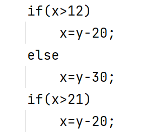
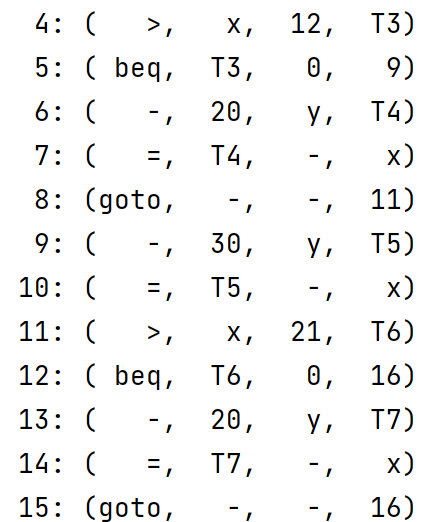
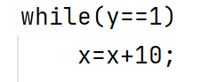
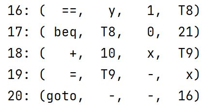

# 实验九 构造能处理完整程序的递归下降翻译器

实验八和实验九一起完成。

在实验七的表达式的属性处理的基础上，增加了对`if else`、`if`、`while`语法的属性处理。

主要是需要确定属性计算的顺序。


## 处理`if else`与`if`语法

```C
else if (strcmp(c, "if") == 0) {
        node->type = 1;
        char *tmp2 = get_next();
        if (strcmp(tmp2, "(") != 0) {
            error();
        }
        node->bool = bool();
        char *tmp3 = get_next();
        if (strcmp(tmp3, ")") != 0) {
            error();
        }
        int bne_index = index_quadruples;
        get_code("bne", node->bool->systhesized, "0", "-"); // 如果与0不等，跳转到if结束
        node->stmt = stmt();
        int end_if_index = index_quadruples;
        get_code("goto", "-", "-", "-"); // 如果else存在 ，if语句结束要跳转到else结束
        int else_or_stat_index = index_quadruples;
        quadruples[bne_index].result = itoa(else_or_stat_index);
        node->else_ = else_();
        if (node->else_->type == 1) { // 如果else不存在
            quadruples[end_if_index].result = itoa(else_or_stat_index);
        } else { // 如果else存在
            quadruples[end_if_index].result = itoa(index_quadruples);
        }

    }
```

输入：



输出：



`if`语句会判断`<bool>`是否为0，即使用`bne`指令判断`<bool>`与`0`是否相等，如果不等，则跳过`if`里的语句。跳转的地址需要在`if`和`else`中的语句全部解析完后才可得知。所以在最后进行回填。

`if`中的语句结束后还需要跳转，如果`else`存在，就跳转到`else`结束后；如果`else`不存在，就跳转到下一条。

## 处理`while`语法

```C
else if (strcmp(c, "while") == 0) {
        node->type = 2;
        char *tmp4 = get_next();
        if (strcmp(tmp4, "(") != 0) {
            error();
        }
        int bool_index = index_quadruples;
        node->bool = bool();
        char *tmp5 = get_next();
        if (strcmp(tmp5, ")") != 0) {
            error();
        }
        int beq_index = index_quadruples;
        get_code("beq", node->bool->systhesized, "0", "-"); // 如果与0相等，跳转到while结束
        node->stmt = stmt();
        get_code("goto", "-", "-", itoa(bool_index)); // 如果while结束，跳转到while开始
        int end_while_index = index_quadruples;
        quadruples[beq_index].result = itoa(end_while_index);

```

输入：



输出：



`while`的`<stat>`结束后，会跳转回`<bool>`之前。如果`<bool>`值与0相等，则跳转到`<stat>`后。

