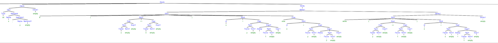

# 实验六 对完整程序的递归下降分析

实验五和实验六一起完成。

这次实验讲之前写的预处理程序、标识符识别、词法分析、和语法分析程序连接在了一起。

语法分析主要基于实验四，新增了多个产生式。

```
<Block> 	--> { <Decls> <Stmts> }
<Decls> 	--> <Decl> <Decls’>
<Decls’> 	--> <Decl> <Decls’> | empty
<Decl> 	    --> <Type> <Namelist>;
<Namelist> 	--> <Name> <Namelist’> 
<Namelist’> --> , <Name> <Namelist’> | empty
<Type> 	    --> int
<Name> 	    --> id	
<Stmts> 	--> <Stmts’>
<Stmts’> 	--> <Stmt> <Stmts’> | empty
<Stmt> 	    --> id = <Expr>
<Stmt> 	    --> if (BOOL) <Stmt> <Else>
<Stmt> 	    --> while (BOOL) <Stmt>
<Stmt> 	    --> <Block>
<Else> 	    --> else <Stmt> | empty
<BOOL> 	    --> <Expr> <Relop> <Expr>
<Relop> 	--> < | > | <= |  >=  | == | !=
<Expr> 	    --> <Term> <Expr1>
<Expr1> 	--> <Addop> <Term> <Expr1> | empty
<Term> 	    --> <Factor> <Term1>
<Term1> 	--> <Mulop> <Factor> <Term1> | empty
<Factor> 	--> id | number |(<Expr>)
<Addop> 	--> + | -
<Mulop> 	--> * | /

```


实验过程中需要注意的是，在连接词法分析器和语法分析器的时候，用到的全局变量，需要使用`extern`关键字。


新增error()函数，在匹配到不该匹配的字符的时候报错。

```C
void error() {
    printf("%d\n", index);
    roll_back();
    char *error_msg = get_next();
    printf("error near %s", error_msg);
    exit(0);
}
```


输入如下程序：


得到语法树

`[Decls [{][Decls [Decl [Type [int]][Namelist [Name [x]][Namelist1 [,][Name [y]][Namelist1 [empty]]]]][Decls1 [empty]]][Stmts [Stmts1 [Stmt [if][(][Bool [Expr [Term [Factor [x] ][Term1[empty]] ][Expr1[empty]] ][==][Expr [Term [Factor [0] ][Term1[empty]] ][Expr1[empty]] ]][)][Stmt [id[x]] [=][Expr [Term [Factor [y] ][Term1[empty]] ][Expr1 [Addop[-]] [Term [Factor [1] ][Term1[empty]] ][Expr1[empty]] ]]][Else [else][Stmt [id[x]] [=][Expr [Term [Factor [y] ][Term1[empty]] ][Expr1 [Addop[-]] [Term [Factor [2] ][Term1[empty]] ][Expr1[empty]] ]]]]][Stmts1 [Stmt [while][(][Bool [Expr [Term [Factor [y] ][Term1[empty]] ][Expr1[empty]] ][==][Expr [Term [Factor [1] ][Term1[empty]] ][Expr1[empty]] ]][)][Stmt [id[x]] [=][Expr [Term [Factor [x] ][Term1[empty]] ][Expr1 [Addop[+]] [Term [Factor [1] ][Term1[empty]] ][Expr1[empty]] ]]]][Stmts1 [empty]]]]][}]]`

使用 [Syntax Tree Generator (mshang.ca)](http://mshang.ca/syntree/) 生成图片。

