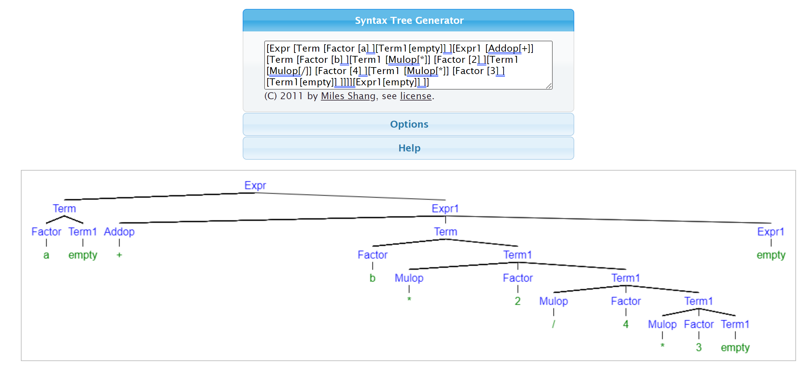
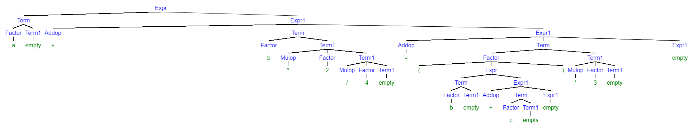

# 实验四 对算术表达式的递归下降分析

这次实验花费了比预期多得多得时间，踩了一些坑。

用C语言写了一部分后，觉得用类的话更加优雅，每个非终结符一个类，每个类有自己的打印函数，方便递归调用，于是速成C++面对对象的语法，重写写好的C语言的代码。

但使用C++的时候在类前置声明遇到了问题，类之间存在嵌套的调用，在这里卡了很久没解决，最后搞不动了，老老实实回去用C语言写了。

例，创建Factor节点：

```C
Factor* factor() {
	char c = get_next();
	Factor* node = (Factor*)malloc(sizeof(Factor));
	if (isdigit(c)) {
		node->type = 2;
		node->number = c - '0';
	}
	else if (c == '(') {
		node->type = 3;
		node->expr = expr();
		get_next();
	}
	else {
		node->type = 1;
		node->id = c;
	}

	return node;
}
```


生成语法树实在搞不动了，最后遍历树后用 [Syntax Tree Generator (mshang.ca)](http://mshang.ca/syntree/) 来生成。

`a+b*2/4*3`的语法树：



`a+b*2/4-(b+c)*3` 的语法树

